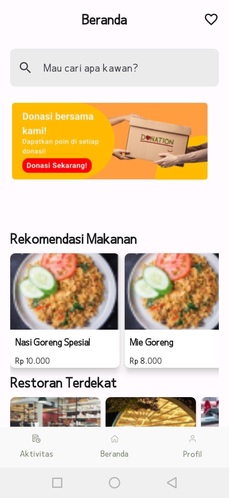
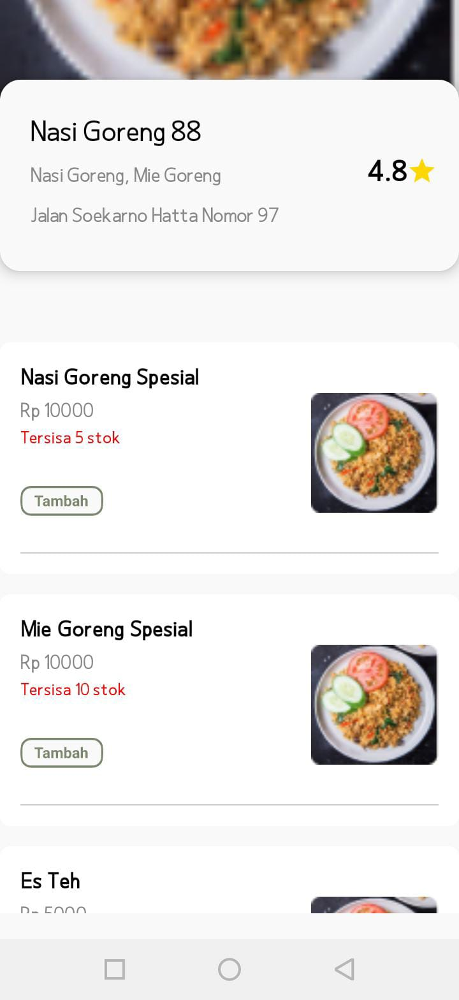
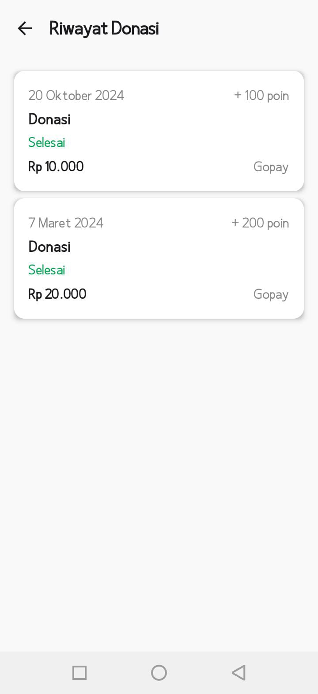
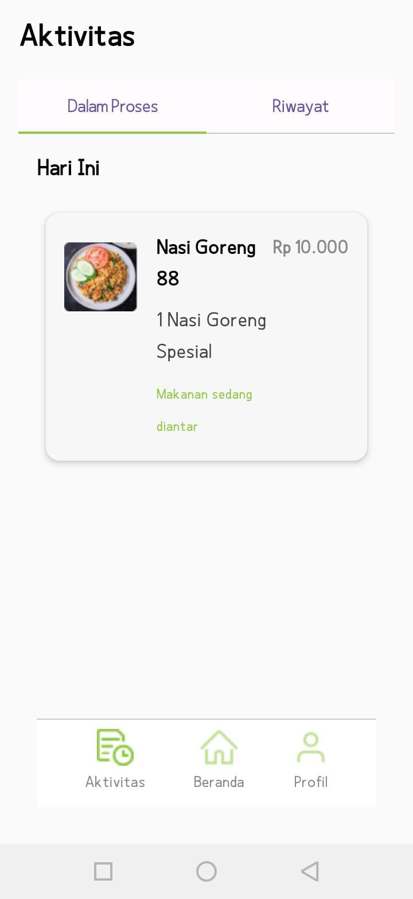

# 🍱 LeftOverLove

LeftOverLove adalah aplikasi Android berbasis **Kotlin** dan **Jetpack Compose** yang bertujuan membantu mengurangi pemborosan makanan (*food waste*) dengan menghubungkan restoran dan pengguna melalui fitur donasi makanan, pemesanan, serta pengelolaan aktivitas pengguna.

---

## 📱 Download APK

Ingin mencoba aplikasi tanpa melakukan build project?

➡️ **Download versi terbaru melalui halaman Releases**

**🔗 https://github.com/athyzr/LeftOverLove/releases/latest**

---

## 📸 Screenshots

| Home |
|------|
 |

| Food Detail | Restaurant Detail | Donation History |
|--------------|-------------------|----------|
|  |  |  |

| Activity |
|------------|
|  | 

---

# ✨ Features

- 🚀 Splash Screen
- 🔐 User Authentication (Login & Register)
- 🍽 Browse Restaurants & Foods
- 📄 Food Detail
- 🏪 Restaurant Detail
- ❤️ Favorite Foods
- 🎁 Food Donation
- 📋 User Activity
- 👤 User Profile
- ✏️ Edit Profile

---

# 🛠 Tech Stack

- Kotlin
- Jetpack Compose
- Material 3
- Navigation Compose
- Firebase Authentication
- Firebase Firestore
- Firebase Realtime Database
- Gradle Kotlin DSL

---

# 🏗 Architecture

The application follows the MVVM (Model-View-ViewModel) architecture.

```
UI (Jetpack Compose)
        │
   ViewModel
        │
   Repository
        │
Firebase Services
```

---

# 📂 Project Structure

```
app/
 ├── src/
 │   ├── main/
 │   │   ├── java/
 │   │   ├── res/
 │   │   └── AndroidManifest.xml
 │   └── google-services.json
 └── build.gradle.kts
```

---

# ⚙ Prerequisites

Pastikan telah menginstal:

- Android Studio
- JDK 11 atau lebih baru
- Android SDK
- Emulator Android atau perangkat fisik

---

# 🚀 Getting Started

## 1. Clone Repository

```bash
git clone https://github.com/athyzr/LeftOverLove.git
```

## 2. Open Project

Buka project menggunakan Android Studio.

## 3. Sync Gradle

Tunggu hingga proses Gradle Sync selesai.

## 4. Run Application

Melalui Android Studio tekan tombol **Run**, atau gunakan command berikut.

### Windows

```bash
gradlew.bat assembleDebug
```

### Linux / macOS

```bash
./gradlew assembleDebug
```

---

# 🔥 Firebase Configuration

Project menggunakan layanan Firebase berikut:

- Firebase Authentication
- Firebase Firestore
- Firebase Realtime Database

Pastikan file berikut tersedia:

```
app/google-services.json
```

Apabila menggunakan project Firebase yang berbeda, ganti file konfigurasi tersebut sesuai project milik Anda.

---

# 📄 License

This project was created for educational and portfolio purposes. Feel free to fork and further develop it for learning.
